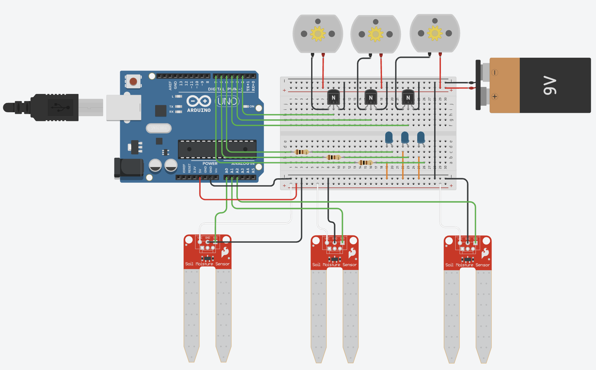

Arduino code for a watering system for multiple plants. The simulation can be seen on Tinkercad: https://www.tinkercad.com/things/4ragbPV0CgW-watering-system?sharecode=ihz-ycwX3DRoInQS_fkWSk1bi3Ii1kMWKYq3PLvLKlo